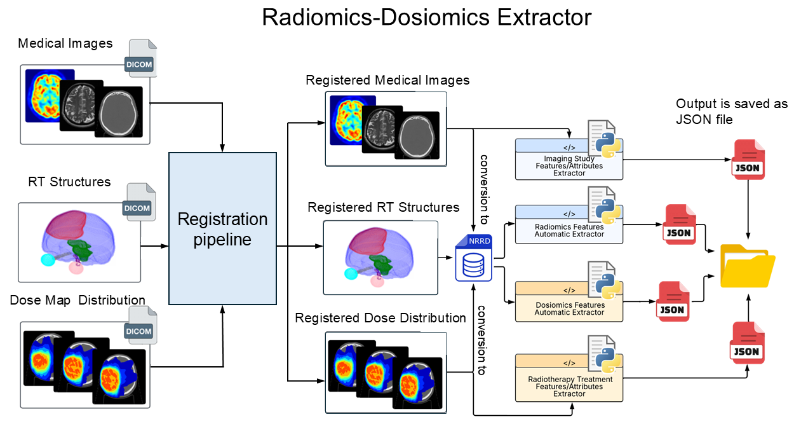

# mCODE-MOSAICO: Multi (Radi-Dosi)Omics features Acquisition and Images Characteristics for Oncology

## Table of Contents
  *  [Authors](#Authors)
  *  [Motivation](#Motivation)
  *  [Features](#Features)
  *  [Dependencies](#Dependencies)
  *  [Installation](#Installation)
  *  [Usage and Examples](#UsageandExamples)
  *  [License](#License)
  *  [How to Cite](#HowtoCite)
  *  [References](#References)
## Authors
Odette Rios-Ibacache

Contact email: <a href="mailto:odette.riosibacache@mail.mcgill.ca">odette.riosibacache@mail.mcgill.ca</a>

Website:  [www.kildealab.com](https://www.kildealab.com) 

## Motivation
The scattered nature of health data, along with the lack of standardization and interoperability, limits the potential of Artificial Intelligence (AI) incorporating medical images and radiomics to automate outcomes assessment in radiotherapy (RT) treatments. Establishing a standardized lexicon and data structure could enhance multicenter clinical studies. Our goal is to structure patient data relevant to RT research and create a knowledge base (KB), a machine-readable repository, with an ontology as a domain, including radiomics and medical images.  We aim to identify the essential data elements needed to encode radiomics and dosiomics information and develop an ontology. We are building our study on **Minimal Common Oncology Data Elements (mCODE)**, an international initiative to improve interoperability by establishing a core set of structured data elements. We built an extension to link patients' medical image data, radiomics, and dosiomics with their health records. A review of the existing literature on the standardization of radiomics and dosiomics methods was conducted to include the minimum parameters that would impact their acquisition. We included data elements recommended by the Image Biomarker Standardisation Initiative (IBSI) guidelines. We developed a feature-extractor module, mCODE-MOSAICO, which converts and stores the elements for our extension, automatically extracting the radiomics and dosiomics features from all the interested Region Of Interests (ROIs). 

## Features


## Dependencies
  *  [shutil](https://docs.python.org/3/library/shutil.html)
  *  [matplotlib](https://matplotlib.org/)
  *  [scipy](https://scipy.org/)
  *  [skimage](https://scikit-image.org/)
  *  [numpy](https://numpy.org/)
  *  [gc](https://docs.python.org/3/library/gc.html)
  *  [pandas](https://pandas.pydata.org/)
  *  [pydicom](https://pydicom.github.io/pydicom/stable/)
  *  [SimpleITK](https://docs.python.org/3/library/json.html)
  *  [pynrrd](https://pynrrd.readthedocs.io/en/stable/index.html#)

## Installation

By pulling the latest version from GitHub. Please note that your Python installation should be 3.6 or later. 
```
pip install git+https://github.com/kildealab/mCODE-MOSAICO.git
```
## Usage and Examples

<pre> /path/to/patient/directories/ 
├── 📁patient_id
│   ├── 📁medical_images
│       ├── 📁 date_modality
│           ├──📄image_study.json
│           ├──📄acquisition_properties.json
│           ├──📄modality_properties.json 
│           └──📄date_modality.nrrd 
│       ├── ... 
│   ├── 📁RT_plans
│       ├── 📁 date_RT
│   ├── 📁radiomics
│       ├── 📁 ROI_radiomics
│           ├── 📁 date_modality
│               ├──📄seg_ROI.nrrd
│               ├──📄seg_ROI_radiomics.json
│               └──📁 voxel_based
│                  ├──📄feature1.nrrd
│                  ├──📄feature2.nrrd
│                  └── ... 
│        ├── 📁 ROI2_radiomics
│            ├── 📁 date_modality
|                ├──📄seg_ROI2.nrrd
│                ├──📄seg_ROI2_radiomics.json
│                └──📁 voxel_based
│                   ├──📄feature1.nrrd
│                   ├──📄feature2.nrrd
│                   └── ... 
│   └── 📁dosiomics
│       ├── 📁 ROI_dosiomics
│           ├── 📁 date_RT
│               ├──📄seg_ROI.nrrd
│               ├──📄seg_ROI_dosiomics.json
│           └──📁 voxel_based
│              ├──📄feature1.nrrd
│              ├──📄feature2.nrrd
│              └── ... 
│ 
...
├── 📁patient_idN
|   └── ...
</pre>

## License 
This project is provided under the GNU GLPv3 license to preserve open-source access to any derivative works. See the LICENSE file for more information.
## References
* Traverso, A., Wee, L., Dekker, A., & Gillies, R. (2018). Repeatability and Reproducibility of Radiomic Features: A Systematic Review. International journal of radiation oncology, biology, physics, 102(4), 1143–1158. https://doi.org/10.1016/j.ijrobp.2018.05.053
* Vallières, M., Zwanenburg, A., Badic, B., Cheze Le Rest, C., Visvikis, D., & Hatt, M. (2018). Responsible Radiomics Research for Faster Clinical Translation. Journal of nuclear medicine : official publication, Society of Nuclear Medicine, 59(2), 189–193. https://doi.org/10.2967/jnumed.117.200501
* Zwanenburg, Alex, Stefan Leger, Martin Vallières, and Steffen Löck. "Image Biomarker Standardisation Initiative." ArXiv, (2016). Accessed June 18, 2025. https://doi.org/10.1148/radiol.2020191145.


